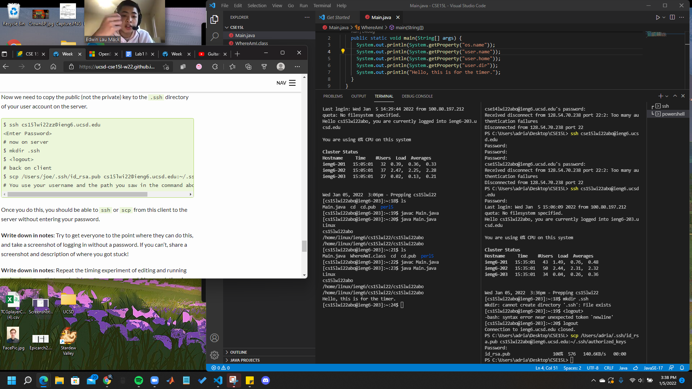

<h1 style="font-size:30px;">Week 2 Lab Report</h1>

This will be a tutorial for incoming 15L students about how to log into a course-specific account on ieng6. Included will be short descriptions and screenshots of:
1. Installing VScode
2. Remotely Connecting
3. Trying Some Commands
4. Moving Files with scp
5. Setting an SSH Key
6. Optimizing Remote Running

