<h1 style="font-size:30px;">Week 2 Lab Report</h1>
 
 
<h3 style="font-size:12px;">Summary</h3>
This will be a tutorial for incoming 15L students about how to log into a course-specific account on ieng6. Included will be short descriptions and screenshots of:
1. Installing VScode
2. Remotely Connecting
3. Trying Some Commands
4. Moving Files with scp
5. Setting an SSH Key
6. Optimizing Remote Running

 
  
<h3 style="font-size:12px;">Installing VScode</h3>
(1) First, Install VSCode. The link can be found <a href="https://code.visualstudio.com/download">here</a>. Download the correct version for your PC. Once done, it should look like the second image depicted underneath.  
 
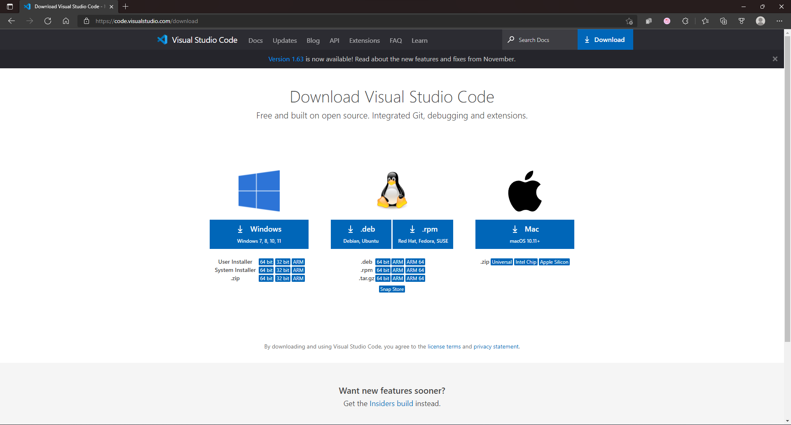

First, download VS code

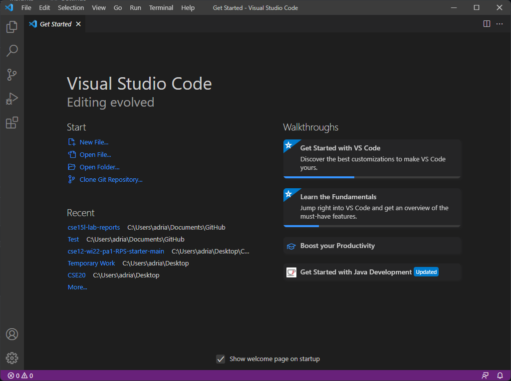

Once download, open and it should look like this.
 
 

<h3 style="font-size:12px;">Remotely Connecting</h3>
(2) Now that Visual Studio Code is installed, you will need to remote connect to the UCSD server. In order to do this, first install OpenSSH (if on Windows), <a href="https://docs.microsoft.com/en-us/windows-server/administration/openssh/openssh_install_firstuse">here</a>. Following that, please find your login credentials, from UCSD <a href="https://sdacs.ucsd.edu/~icc/index.php">here</a>. Once you have the account information, open Visual Studio Code and type <code>ssh cs15lwi22zz@ieng6.ucsd.edu</code> (cs15lwi22zz will be replaced by your course-specific login) from the terminal. You'll likely be asked a question in the terminal; just answer yes. Following this, type your account-specific password in order to connect, as displayed in the images below. Now, you are connected to your ieng6.

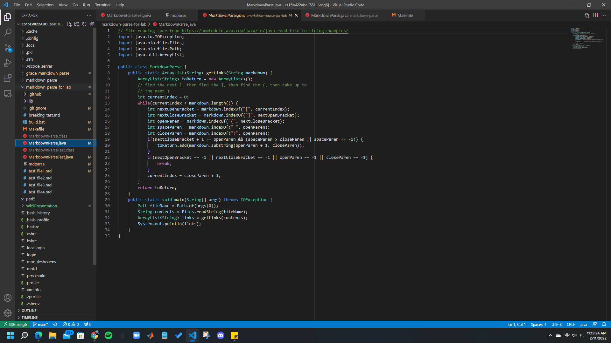

Once OpenSSH is set up, follow the instructions above; your screen should look like this.
 
 

<h3 style="font-size:12px;">Trying Some Commands</h3>
(3) Now that you are remotely connected, you can try some commands. I personally tried the <code>cat</code> command which can print out a file's contents, for example. Depending on the commands which are tried, different results may occur and/or some may not work (on your local machine, for example). Displayed are some examples:

Here are some command examples and their functions. Credits to Cao, from CSE12.
 
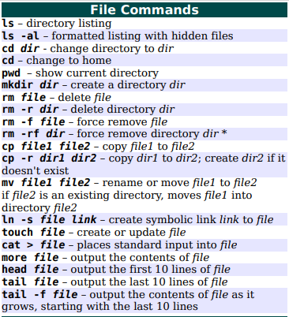

 
Here is an example of the cat command being run on a window's client. As my laptop does not have linux enabled, it failed.
 
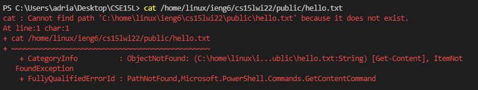
 
Here is the cat command being run on the UCSD server; as seen, the example file was not accessible to my account, however, the command did run.
 
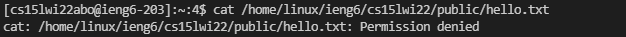
 
 

<h3 style="font-size:12px;">Moving Files With SCP</h3>
(4) Now that you have tried out several commands, it is time to test the scp command, which moves files from the client to the server. In order to use this, the <code>scp [file_name] cs15lwi22zz@ieng6.ucsd.edu:~/</code> command must be run on the local computer's terminal. Once done, you will be prompted for the password; submit it and the scp command should have copied the file over to the server.

Here is the scp command being run on the client.
 
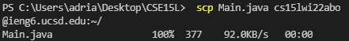

 
Here is the result, shown on the server.
 
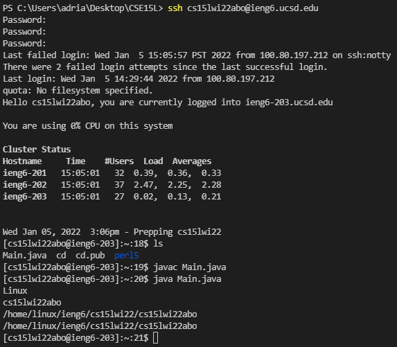
 
 

<h3 style="font-size:12px;">Getting an SSH Key</h3>
(5) Of course, this is a slow process -- in our group, it took over 50 seconds to copy files from the client to the server. In order to speed it up, we set up SSH keys, which can quickly allow logging into the server via local, saved files. If on windows, there is an extra step; you must go and follow the steps shown <a href="https://docs.microsoft.com/en-us/windows-server/administration/openssh/openssh_keymanagement#user-key-generation">here</a>. It should be done like this:

First, set up the key on your client. Credits to Joe Politz, Week 1 Lab.
 
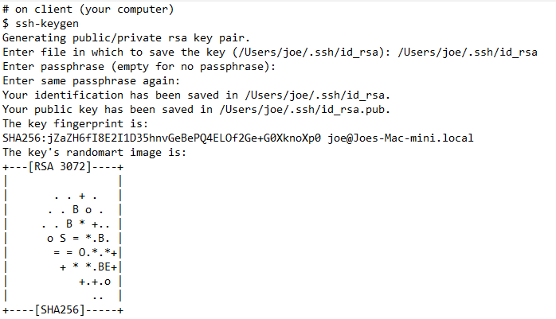

 
Then, establish it on thhe server. Credits to Joe Politz, Week 1 Lab.
 
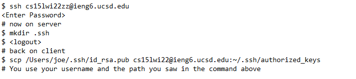

 
Once done, it should look like this (example taken from my terminal during the project).
 
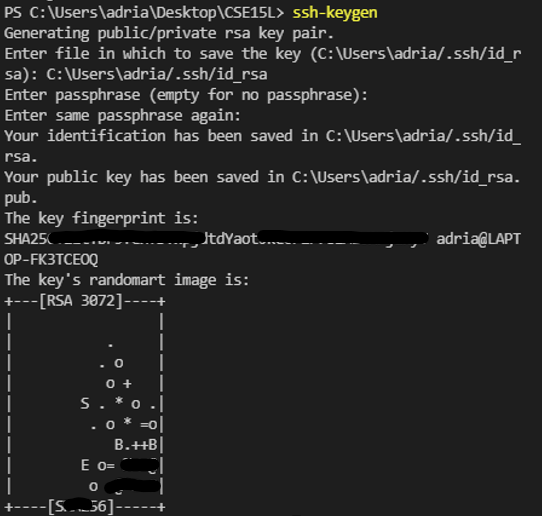
 
 

<h3 style="font-size:12px;">Optemized Remote Running</h3>
(6) Now that all this has been completed, your remote running experience has been optimized. However, it can be optimized even further via the use of one extra command - <code>ssh cs15lwi22zz@ieng6.ucsd.edu "javac [file_name]; java [file_name]"</code>, which will take a file from the client, copy it to the server, and then run it in the server in one step, without any passwords. 

By doing these steps, running the code takes at most 25-30 seconds and it only takes one singular command to copy and move the code over to the remote server and run it. Previously, we had to copy the file over, compile it on the remote host, and then run it on the remote host -- all while typing passwords, which meant that we had a minimum of 4 lines to type -- but often more than that. Over 50 seconds were saved via our optimizations of using the command shown above and setting up keygens. Additionally, I typed on average 220-240 characters less.

Shown underneath is the optimized running process once the key has been set up -- the password is no longer required for every step.
 
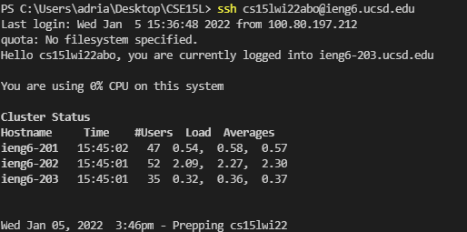

 
 

Thank you for reading my full first lab report which serves as a tutorial on using ieng6! This concludes my lab report for Weeks 1 and 2 of CSE15L! 

<a href="https://lasteternity.github.io/cse15l-lab-reports/">Click Here To Go Back Home!</a>
