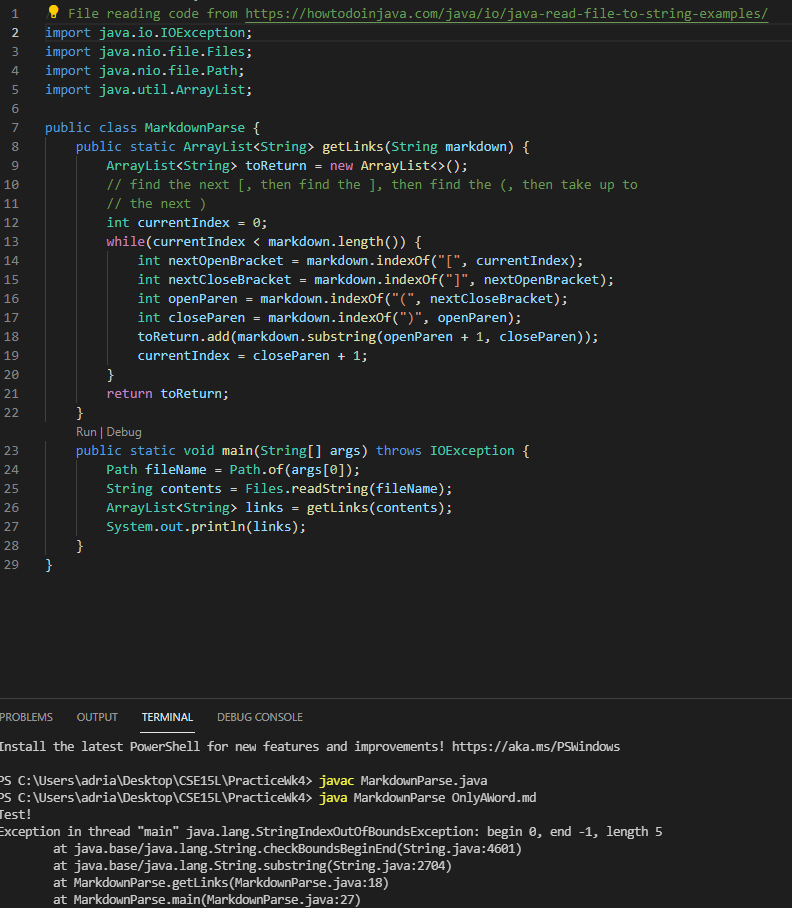
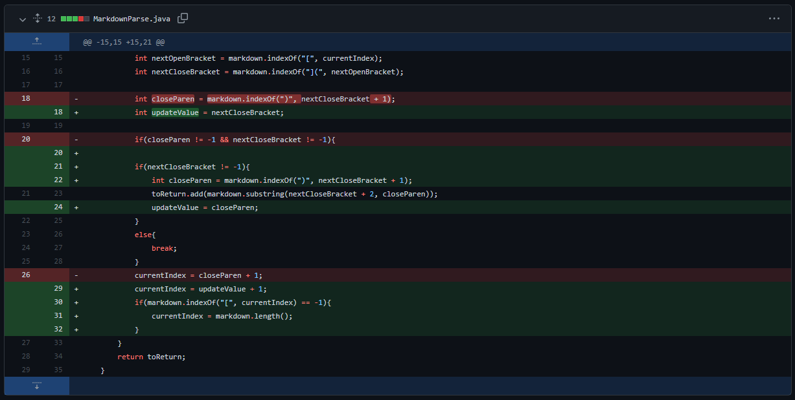
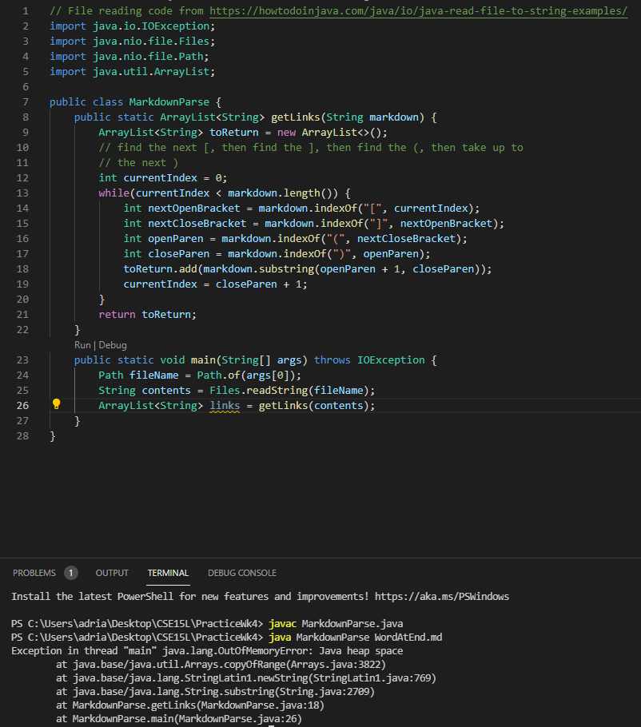
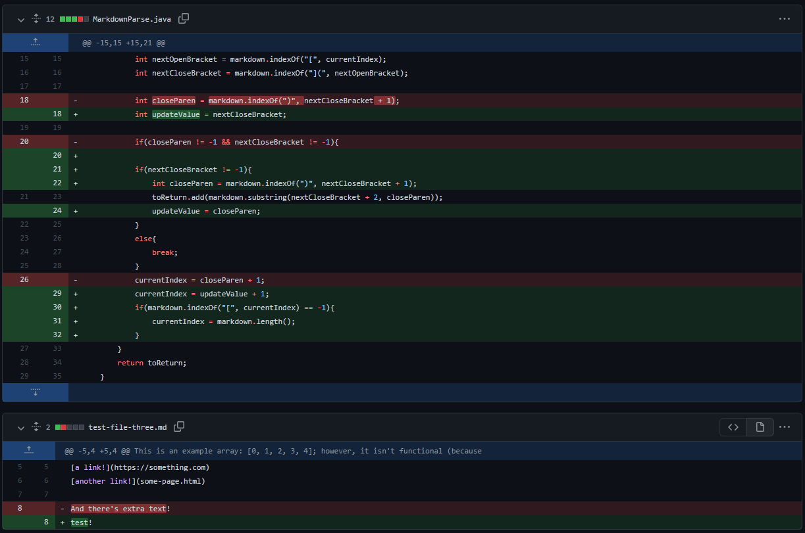

<h1 style="font-size:35px;">Week 2 Lab Report</h1>
 
 
<h3 style="font-size:25px;">Summary</h3>
This will be an example of three bugs faced while testing an example program given to us by Professor Politz; a link to the program can be found <a href="https://github.com/ucsd-cse15l-w22/markdown-parse">here</a>.
 
<h3 style="font-size:25px;">First Bug</h3>

The first bug we noticed and worked through for this program was caused by this markdown file: <a href="https://github.com/LastEternity/markdown-parse/blob/main/test-file-three.md"> Parenthesis After Brackets</a>. This bug was was caused because the original program was only looking for parenthesis following brackets, disregarding the space inbetween. This meant that non-links could be recognized as links - as seen in the file. This caused the symptom shown below to appear: 

 
Here is the symptom caused by the bug:
 

 

As seen above, unwanted text was caught and processed/shown as a link (the first item - "because it hasn't been substantiated"), for the reasons described above.

 
Here is the code which solved the bug:
 

 

The new code functions by only searching for parenthesis immediately following a bracket, which allows it to avoid cases where parenthesis accidentally follow brackets in normal text.

 
<h3 style="font-size:25px;">Second Bug</h3>
The second bug we noticed and worked through for this program was caused by this markdown file: <a href="https://github.com/LastEternity/markdown-parse/blob/main/test-file-four.md"> No Links</a>. This bug was was caused because the original program was only able to look for for closed brackets and parenthesis. When the call to <code>toReturn.add(markdown.substring(openParen + 1, closeParen));</code> was made, the values of -1 (i.e. item not found) were inserted, causing an invalid call. In order to fix that, we looked for the index of the next closed brackets; if it didn't exist (which means there wasn't any link), then it would break out of the while loop. The bug caused the symptom shown below to appear: 

 
Here is the symptom caused by the bug:
 

 

As seen above, the call to substring was invalid -- it was not able to handle a substring of 0 to -1.

 
Here is the code changes which solved the bug by checking for if an index was found:
 

 

 
<h3 style="font-size:25px;">Third Bug</h3>
The third bug we noticed and worked through for this program was caused by this markdown file: <a href="https://github.com/LastEternity/markdown-parse/blob/main/test-file.md"> Word At End</a>. This bug was was caused because the original program was only able to end on a closed parenthesis. If any other character were added, at the end, the while loop would just continue forever, causing an invalid heap error. The bug caused the symptom shown below to appear: 

 
Here is the symptom caused by the bug:
 

 

As seen above, the loop was unable to end and eventually burnt out.

 
Here is the code changes which solved the bug by checking for if there would be remaining parenthesis at the end; if there weren't, then it would exit the loop:
 

 

 
 
 
 

Thank you for reading my second lab report, which depicts the debugging process! This concludes my lab report for Weeks 2 and 4 of CSE15L! 

<a href="https://lasteternity.github.io/cse15l-lab-reports/">Click Here To Go Back Home!</a>
