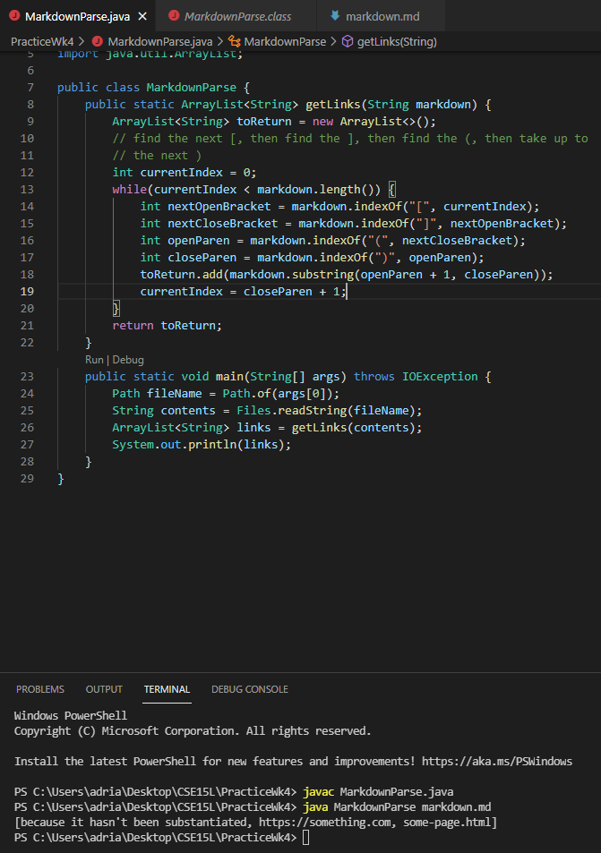
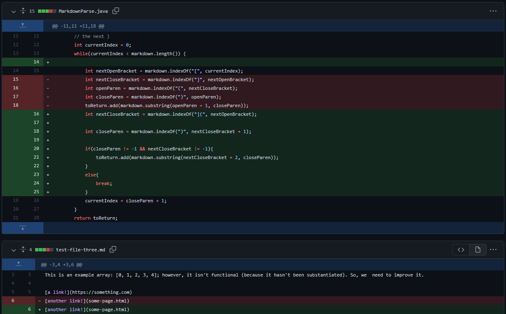

<h1 style="font-size:35px;">Week 2 Lab Report</h1>
 
 
<h3 style="font-size:25px;">Summary</h3>
This will be an example of three bugs faced while testing an example program given to us by Professor Politz; a link to the program can be found <a href="https://github.com/ucsd-cse15l-w22/markdown-parse">here</a>.
 
<h3 style="font-size:25px;">First Bug</h3>

The first bug we noticed and worked through for this program was caused by this markdown file: <a href="https://github.com/LastEternity/markdown-parse/blob/main/test-file-three.md"> Parenthesis After Brackets></a>. This bug was was caused because the original program was only looking for parenthesis following brackets, disregarding the space inbetween. This meant that non-links could be recognized as links - as seen in the file. This caused the symptom shown below to appear: 

 
Here is the symptom caused by the bug:
 

 

As seen above, unwanted text was caught and processed/shown as a link (the first item - "because it hasn't been substantiated"), for the reasons described above.

 
Here is the code which solved the bug:
 

 

The new code functions by only searching for parenthesis immediately following a bracket, which allows it to avoid cases where parenthesis accidentally follow brackets in normal text.

 
<h3 style="font-size:25px;">Second Bug</h3>

 
 
 
 

Thank you for reading my second lab report, which depicts the debugging process! This concludes my lab report for Weeks 2 and 4 of CSE15L! 

<a href="https://lasteternity.github.io/cse15l-lab-reports/">Click Here To Go Back Home!</a>
