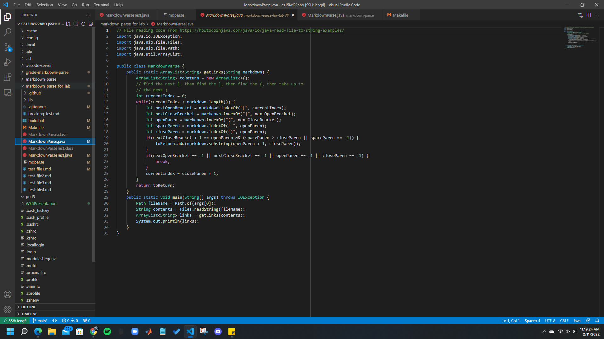

<h1 style="font-size:35px;">Week 3 Lab Report</h1>
 
 

<h3 style="font-size:25px;">Copying Directories With "scp -r"</h3>
This will be an example of copying over an entire directory to the remote host; a link to the program can be found <a href="https://ucsd-cse15l-w22.github.io/week/week5/#group-choice-3-copy-whole-directories-with-scp--r">here</a>.

 

<h3 style="font-size:25px;">Copying To ieng6</h3>
In order to copy a directory over, first check that the current directory is the one that you wish to have copied over with <code>pwd</code>:

 

 

Once the directory is correct, use the command <code>scp -r . cs15lwi22zz@ieng6.ucsd.edu:~/markdown-parse</code> in order to copy over the entire directory; it should look like this:

 

 

 

 

 

<h3 style="font-size:25px;">Running On ieng6</h3>
Now, to check that everything has been copied over to ieng6, log into your account and check the directory with <code>ls</code> and move into the directory using <code>cd</code>; from there you should be able to run the code as shown below and compile and run the tests.

 
Here is what logging in using the remote connect extension looks like:
 

 

 
Here is what compiling and running the code looks like:
 

 

 

<h3 style="font-size:25px;">Streamlining the Process</h3>
Finally, once everything is completed, the entire process can be streamlined by pulling together the commands, as discussed in the first lab report. In my case, I used <code>scp -r . cs15lwi22abo@ieng6.ucsd.edu:~/markdown-parse-example; ssh cs15lwi22abo@ieng6.ucsd.edu "cd markdown-parse-example; make"</code> to run everything in one line; however, alterations to this, such as manually compiling instead of using a Makefile also works. 

 
Here is what copying, compiling, and running the code in one line looks like:
 

 

 
 
 
 

Thank you for reading my third lab report, which depicts copying over an entire directory to a remote host! This concludes my lab report for Weeks 5 and 6 of CSE15L! 

<a href="https://lasteternity.github.io/cse15l-lab-reports/">Click Here To Go Back Home!</a>
