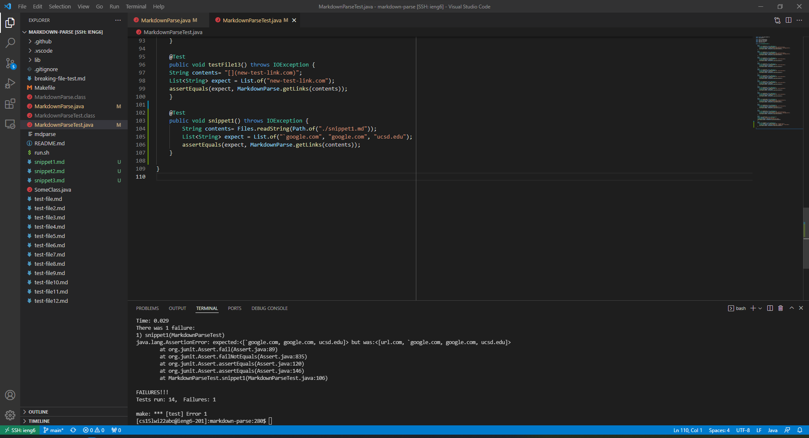
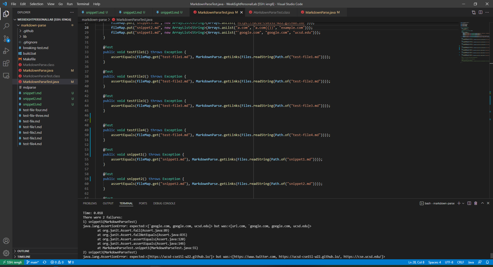

<h1 style="font-size:35px;">Lab Report 4</h1>
 
 

<h3 style="font-size:25px;">Summary</h3>
This week we examined the code found here: <a href="https://ucsd-cse15l-w22.github.io/week/week8/">Week 8 Lab Report</a>.
<a href="https://github.com/LastEternity/markdown-parse">Here</a> is my markdown-parse file and <a href="https://github.com/P2fryang/markdown-parse">Here</a> is the
other group's file.

 

<h3 style="font-size:25px;">Snippet 1</h3>

Shown underneath is the markdown files which we ran the code on.
 

 
<pre>
<code>
`[a link`](url.com)

[another link](`google.com)`

[`cod[e`](google.com)

[`code]`](ucsd.edu)
</code>
</pre>
 

 
For the implementation we reviewed, the JUnit Test failed:

 

 

 
Meanwhile, for our implementation, the JUnit Test also failed, as shown below:

 

 

Shown in the JUnit test, our getLinks() picked up <code>"[url.com, \`google.com, google.com, ucsd.edu]"</code> instead of <code>"[\`google.com, google.com, ucsd.edu]"</code>
