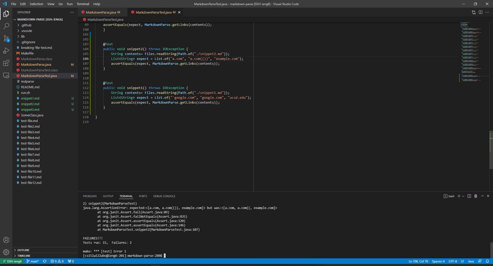

<h1 style="font-size:35px;">Lab Report 4</h1>
 
 

<h3 style="font-size:25px;">Summary</h3>
This week we examined the code found here: <a href="https://ucsd-cse15l-w22.github.io/week/week8/">Week 8 Lab Report</a>.
<a href="https://github.com/LastEternity/markdown-parse">Here</a> is my markdown-parse file and <a href="https://github.com/P2fryang/markdown-parse">Here</a> is the
other group's file.

 

<h3 style="font-size:25px;">Snippet 1</h3>

Shown underneath is the markdown files which we ran the code on.
 

 
<pre>
<code>
`[a link`](url.com)

[another link](`google.com)`

[`cod[e`](google.com)

[`code]`](ucsd.edu)
</code>
</pre>
 

 
For the implementation we reviewed, the JUnit Test failed:

 

 

 
Meanwhile, for our implementation, the JUnit Test also failed, as shown below:

 

 

Shown in the JUnit test, our getLinks() picked up <code>"[url.com, \`google.com, google.com, ucsd.edu]"</code> instead of <code>"[\`google.com, google.com, ucsd.edu]"</code>. The "url.com" was picked up unintentionially, when it should not have been added to the found links because the first part is a code block. This could be fixed in 8-9 lines by adding a new method which checks and substrings out code blocks as needed and then runs the getLinks as originally programmed.

 
 
 

<h3 style="font-size:25px;">Snippet 2</h3>

Shown underneath is the markdown files which we ran the code on.
 

 
<pre>
<code>
[a [nested link](a.com)](b.com)

[a nested parenthesized url](a.com(()))

[some escaped \[ brackets \]](example.com)
</code>
</pre>
 

 
For the implementation we reviewed, the JUnit Test failed:

 

 

 
Meanwhile, for our implementation, the JUnit Passed and picked up <code>"[a.com, a.com(()), example.com]"</code> as shown underneath:

 

 

 

Since our code was already focused in order to be able to catch cases that nest parentheses, brackets, and escaped brackets, there are no changes to be made for this specific case.

 

<h3 style="font-size:25px;">Snippet 3</h3>

Shown underneath is the markdown files which we ran the code on.
 

 
<pre>
<code>
[this title text is really long and takes up more than 
one line

and has some line breaks](
    https://www.twitter.com
)

[this title text is really long and takes up more than 
one line](
    https://ucsd-cse15l-w22.github.io/
)

[this link doesn't have a closing parenthesis](github.com

And there's still some more text after that.

[this link doesn't have a closing parenthesis for a while](https://cse.ucsd.edu/

)

And then there's more text
</code>
</pre>
 

 

For the implementation we reviewed, the JUnit Test failed:

 

 

 
Meanwhile, for our implementation, the JUnit Test also failed, as shown below:

 

 

Shown in the JUnit test, our getLinks() picked up <code>"[https://www.twitter.com, https://ucsd-cse15l-w22.github.io/, https://cse.ucsd.edu/]"</code> instead of <code>"[https://ucsd-cse15l-w22.github.io/]"</code>. The error appears to appear when there is more than one line break between each line; the actual markdown parse does not recognize links with one or more empty lines. To adjust that, I just need to change the code that clears spaces to look for empty lines (should have two back to back \n\n) and not include those.

 

Thank you for reading my fourth lab report, which depicts using markdown parse and finding bugs within it! This concludes my lab report for Weeks 7 and 8 of CSE15L! 

<a href="https://lasteternity.github.io/cse15l-lab-reports/">Click Here To Go Back Home!</a>
