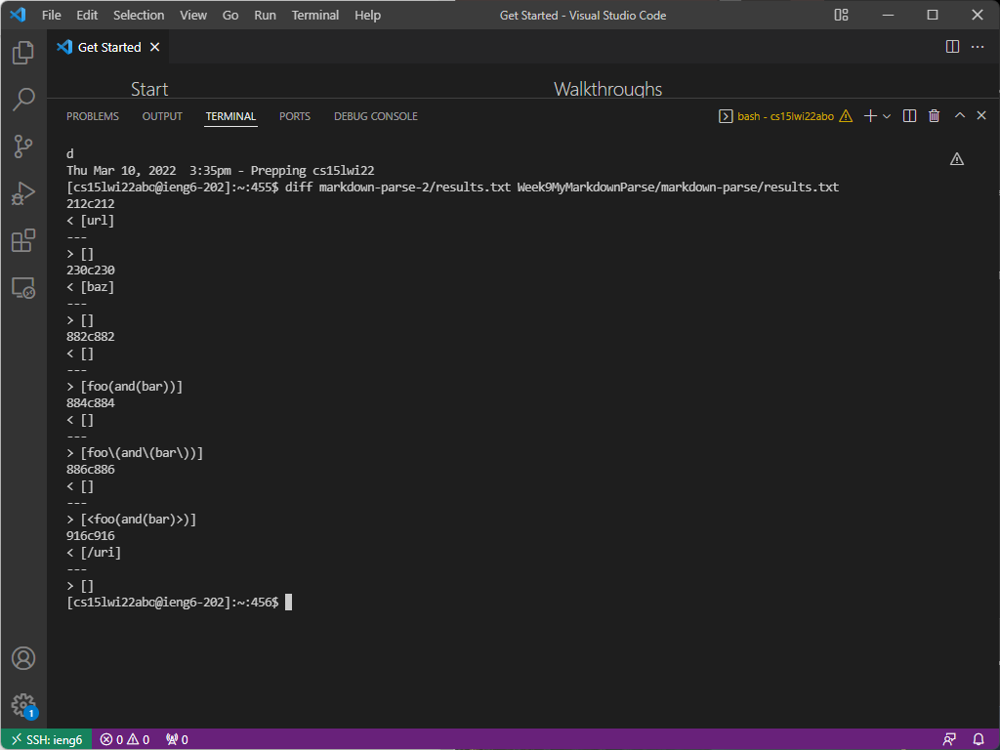
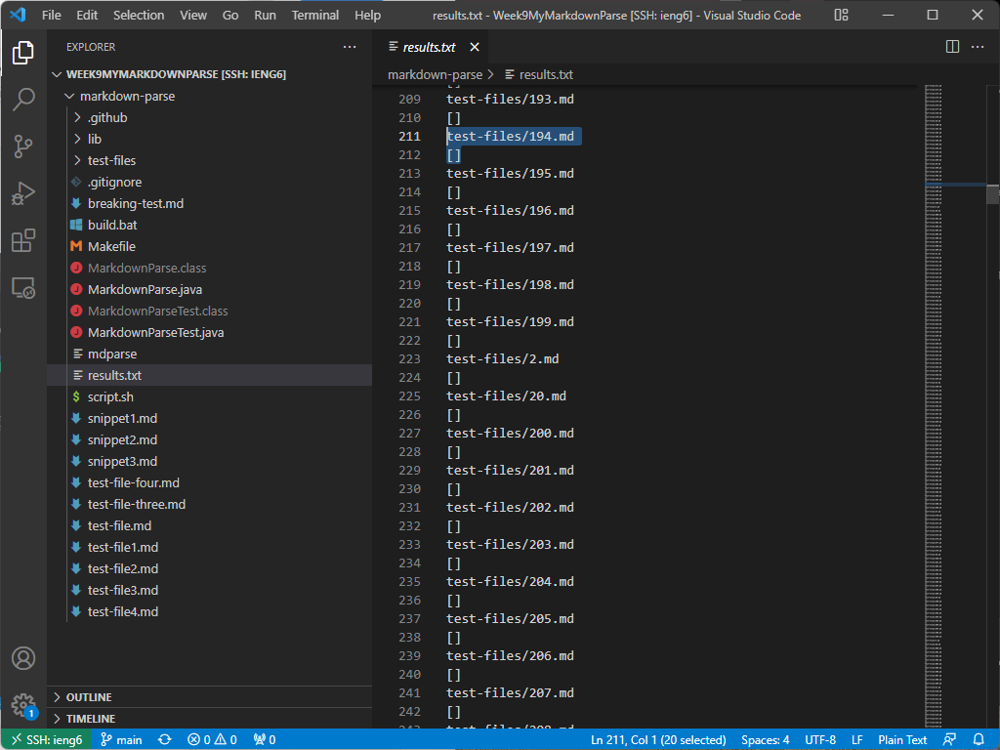
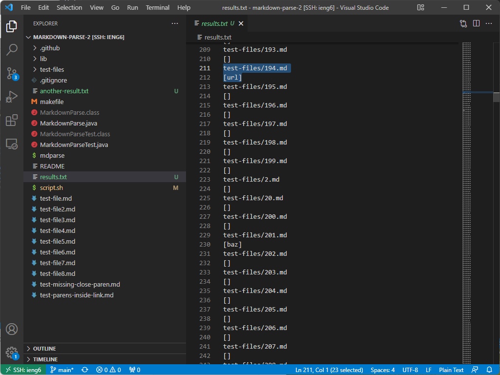
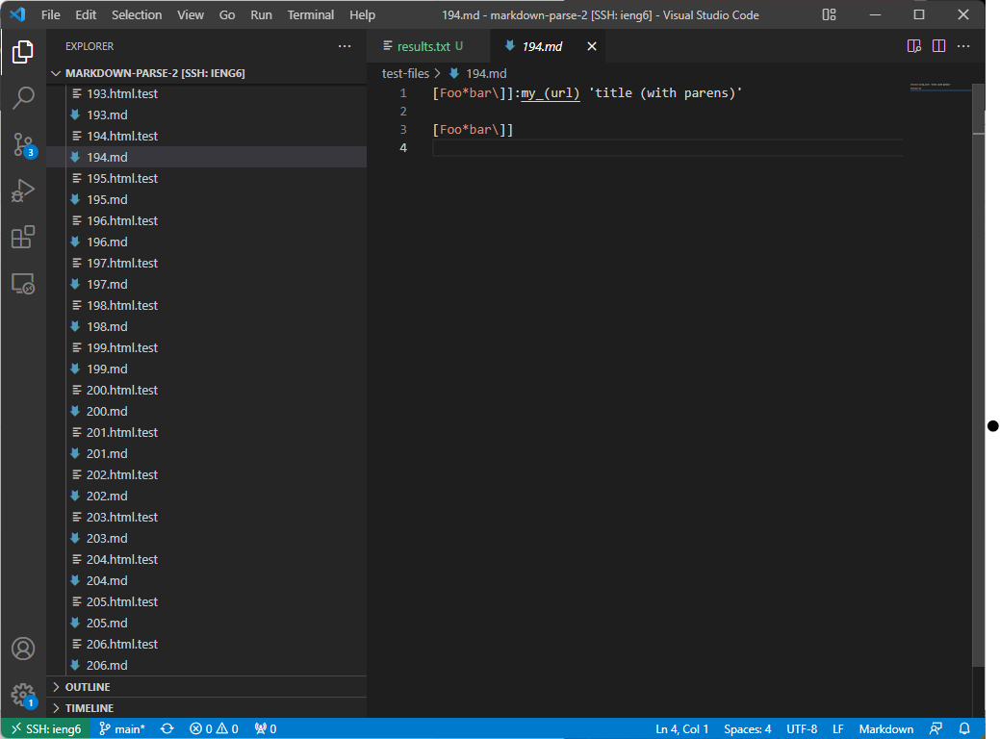

<h1 style="font-size:35px;">Lab Report 5</h1>
 
 

<h3 style="font-size:25px;">Summary</h3>
This week we experimented with the tests provided by the commonmark-spec. For this lab report, we ran tests on my code and Joe's and looked for differing answers. Shown underneath, the differences in results can be seen below; we got the differences in the results of the test by running the diff command with: <code>diff markdown-parse-2/results.txt Week9MyMarkdownParse/markdown-parse/results.txt

 

 
 

<h3 style="font-size:25px;">Difference 1</h3>

Shown underneath is the markdown files which we ran the code on.
 

Here is the output of my code at line 212:
 

 
  
Here is the output of Joe's at line 212:
 

 

 
As can be seen, our implementations differed when reading the 194th markdown test, shown here: 
 

Here is the output of Joe's at line 212:
 

 

  As the expected output is <code>[]</code>, my code worked while Joe's did not.
 
 
 

  
 

Thank you for reading my fifth lab report, which depicts comparing markdown parses and finding bugs within them! This concludes my lab report for Weeks 9 and 10 of CSE15L! 

<a href="https://lasteternity.github.io/cse15l-lab-reports/">Click Here To Go Back Home!</a>
