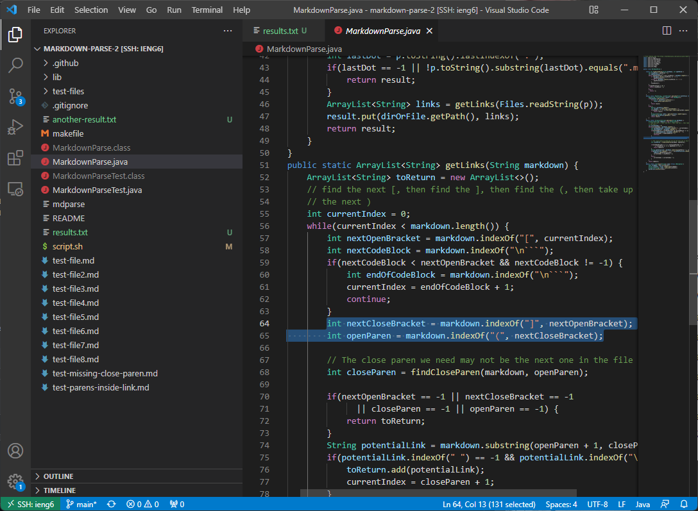
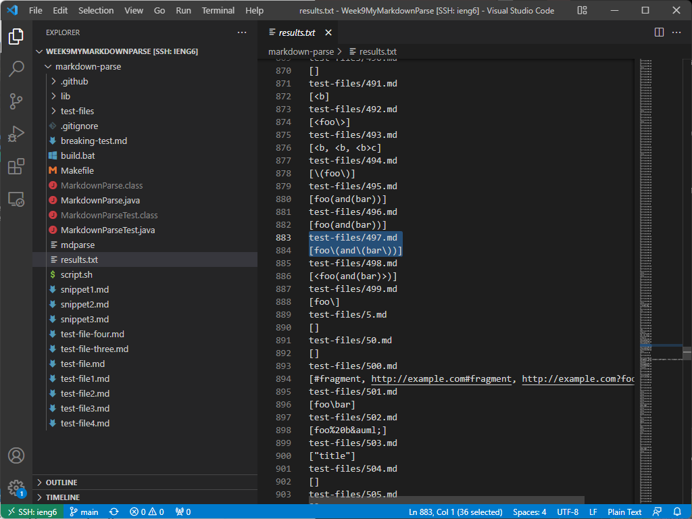
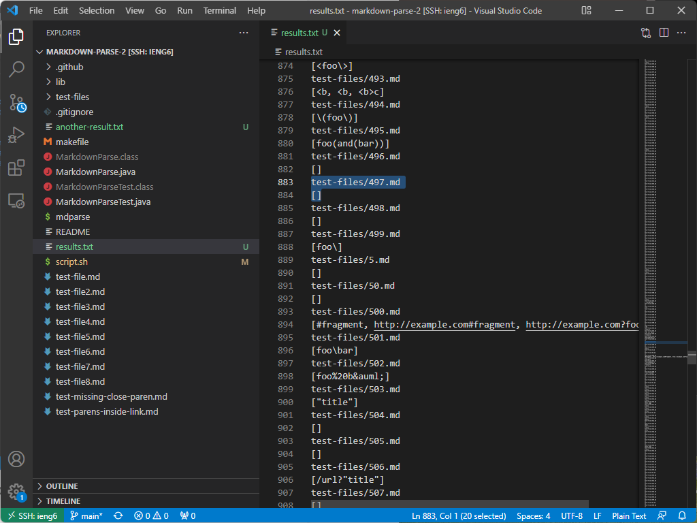
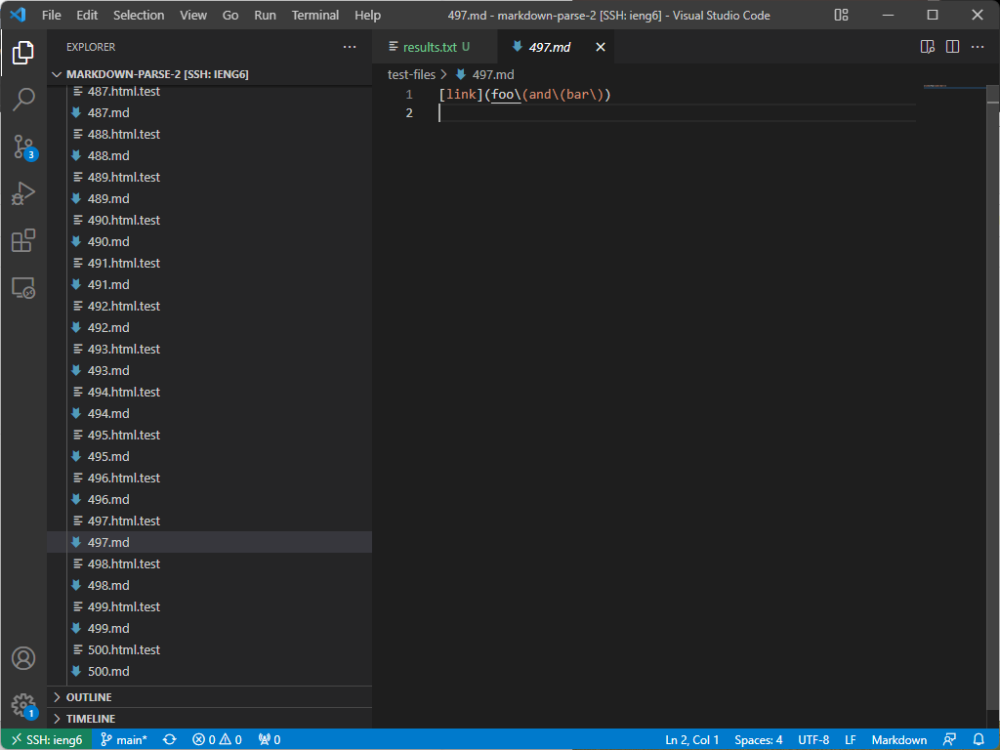
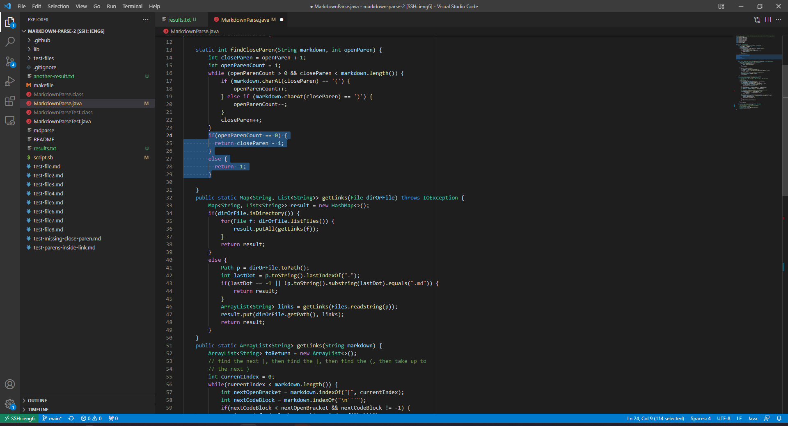

<h1 style="font-size:35px;">Lab Report 5</h1>
 
 

<h3 style="font-size:25px;">Summary</h3>
This week we experimented with the tests provided by the commonmark-spec. For this lab report, we ran tests on my code and Joe's and looked for differing answers. Shown underneath, the differences in results can be seen below; we got the differences in the results of the test by running the diff command with: <code>diff markdown-parse-2/results.txt Week9MyMarkdownParse/markdown-parse/results.txt

 

 
 

<h3 style="font-size:25px;">Difference 1</h3>

Shown underneath is the results we got:
 

Here is the output of my code at line 212:
 

 
  
Here is the output of Joe's at line 212:
 

 

 
As can be seen, our implementations differed when reading the 194th markdown test, shown here: 

 

 

As the expected output is <code>[]</code>, my code worked while Joe's, which caught <code>url</code> as a link did not. The reason why Joe's code did not work was because it did not check for the open parenthesis being next to the close bracket as occured in the markdown file shown above; he should adjust his code to look for ")[" instead of just ")" and "[". The change should happen in these highlighted lines:

 

 
  
  
  
  
 
<h3 style="font-size:25px;">Difference 2</h3>

Shown underneath is the results we got:
 

Here is the output of my code at line 884:
 

 
  
Here is the output of Joe's at line 884:
 

 

 
As can be seen, our implementations differed when reading the 497th markdown test, shown here: 

 

 

As the expected output is <code>[foo\(and\(bar\)]</code>, my code worked while Joe's, which didn't catch anything did not. The reason why Joe's code did not work was because when the findCloseParen method is called, it only checks that there is an equal number of open and closed parenthesis; if there is more open parenthesis than closed ones, then it returns -1, which doesn't add the link to the list. The code should be changed to account and allow for such situations to occur; the change should happen in these highlighted lines:

 

 
 
 

  
 

Thank you for reading my fifth lab report, which depicts comparing markdown parses and finding bugs within them! This concludes my lab report for Weeks 9 and 10 of CSE15L! 

<a href="https://lasteternity.github.io/cse15l-lab-reports/">Click Here To Go Back Home!</a>
